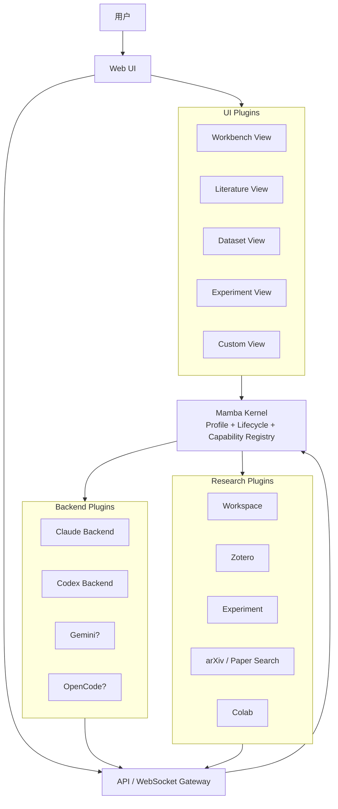
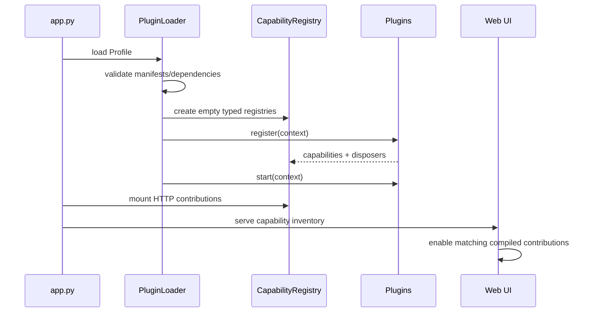

# MambaResearch Kernel 插件化架构设计

> 状态：提案（Draft）
> 日期：2026-08-15
> 适用范围：MambaResearch 后端、前端和内建研究集成
> 参考实现：DeepSeek Harness `0.1.0-rc.5`（官方仓库的 `architecture`、`capability-seams`、`cordis-primer` 文档）

## 1. 摘要

MambaResearch 将从“FastAPI 路由集合 + 前端页面集合”演进为一个薄的
**Mamba Kernel** 和一组可组合插件。

Kernel 只负责四件事：

1. 创建应用上下文并加载 Profile。
2. 发现、校验、挂载和关闭插件。
3. 持有类型化的 Capability Registry。
4. 向后端路由和前端 UI 暴露当前启用的能力清单。

Claude、Codex、Zotero、实验、论文检索、Colab、Literature View 等都不再是
Kernel 的特权代码，而是通过稳定契约接入的插件。

本设计借鉴 DeepSeek Harness 的 **Service Definition / Provider / Consumer**、
可撤销生命周期、Profile 组合和前后端插件图；不引入 Cordis，也不在
MambaResearch 内重建 Agent Loop、Planner、DAG Executor 或模型上下文运行时。

## 2. 背景与根因

当前产品边界已经确定：MambaResearch 是 Claude Code / Codex CLI 之上的研究
工作台，CLI 自己拥有模型路由、工具选择、计划、HITL、skill 和子 agent。
MambaResearch 负责项目、工作区、资产视图、MCP 配置和 PTY 宿主。

问题不在于缺少更多功能，而在于变化点散落在核心流程：

- `app.py` 直接导入并挂载所有路由。
- PTY 路由把 `claude` / `codex` 的命令行、恢复和错误分支写死。
- MCP registry 和 builtin writer 各自维护一份内建服务器列表。
- SQLite schema 用 `CHECK` 约束把 backend 和 served-by 限定为固定字符串。
- 前端 Sidebar 和 `App.tsx` 各自维护导航项与页面 switch。
- Auth、Workbench、Session 列表和权限 UI 直接判断具体 backend 名称。

这些做法在只有两个 backend 时可用，但新增 Gemini、OpenCode 或新的研究
集成时会产生跨路由、跨数据库、跨 UI 的复制修改。

### 2.1 设计目标

- 新增一个 backend 或研究能力时，核心流程不需要新增 `if/else`。
- 插件之间只依赖能力契约，不依赖另一个插件的具体实现。
- 插件配置在启动边界一次解析和校验。
- 启动失败不留下半挂载的路由、MCP 注册或资源。
- 保留当前 PTY 主路径和外部 CLI 的所有权边界。
- 前后端能知道同一组插件是否启用，避免 UI 显示不可用入口。

### 2.2 非目标

以下内容不属于本轮 Kernel：

- 在 MambaResearch 内实现 Agent Loop、Planner、DAG、tool choice 或上下文压缩。
- 复制 Cordis 的全部事件系统、realm 隔离和动态热重载能力。
- 建立远程插件市场、自动安装或不受信任代码执行环境。
- 一次性重写所有目录、路由和前端组件。
- 把现有 CLI 会话 transcript 强行迁移成 Mamba 自己的真相源。

## 3. 参考 DeepSeek Harness 的设计取舍

### 3.1 借鉴的机制

| DeepSeek Harness 机制 | MambaResearch 的对应设计 | 目的 |
| --- | --- | --- |
| `Context` / `Service` | `KernelContext` / 命名空间 Registry | 用稳定能力键隔离实现 |
| Service Definition / Provider / Consumer | Contract / Plugin Provider / Route 或 UI Consumer | 让替换发生在 seam，而不是调用方 |
| `inject` 依赖声明 | `requires` 插件依赖 | 由加载器决定启动顺序 |
| `ctx.effect()` 和 disposer | `register()` 返回 disposer，生命周期反向释放 | 防止资源和注册项泄漏 |
| Profile + Bundle patch | 本地 Profile 的有序插件配置 | 组合不同运行模式 |
| `ctx.*` 服务目录 | `registry.backends`、`registry.mcp` 等类型化目录 | 避免字符串万能服务定位器 |
| Client Module Graph / keyed renderer | 前端编译期插件注册和 view key | Sidebar 与 View 由能力生成 |
| Session / Agent 事件域 | 仅在需要流式观察时增加领域事件 | 避免全局事件总线成为隐式依赖 |

### 3.2 不直接复制的部分

DeepSeek Harness 是 TypeScript 多包运行时；MambaResearch 是 Python FastAPI
加 React/Vite 的双运行时系统。直接嵌入 Cordis 会引入跨语言容器、双重生命周期
和新的打包边界，成本大于收益。

因此 Mamba Kernel 采用本地、显式、最小的契约：先实现 Registry 和生命周期，
只有出现第二个真实消费者时才增加事件或隔离机制。

## 4. 总体架构



插件类别是能力角色，不是强制的目录层级。一个 `zotero` 插件可以同时贡献：

- 一个或多个 MCP server；
- library REST routes；
- credential/settings schema；
- 一个前端 Library View。

这样既保留用户提出的 Backend / Research / UI 三条能力线，也避免为了目录
纯洁性把一个垂直功能拆成互相找不到的多个包。

## 5. Kernel 的职责与边界

### 5.1 Kernel 持有的稳定服务

```text
KernelContext
├── config             已校验的 Profile 和环境配置
├── projects           active project / project identity
├── lifecycle          插件启动、关闭和 disposer
├── capabilities       类型化 Capability Registry
├── http               API router composition
└── inventory          对前端公开的启用能力清单
```

Kernel 可以拥有项目注册表、应用数据库初始化和静态资源宿主，因为这些是
所有插件共享的宿主能力；它不拥有某个具体模型、研究服务或页面的业务规则。

### 5.2 Kernel 不持有的内容

- Claude/Codex 的命令行参数细节；
- Zotero API 请求和凭据格式；
- MCP server 内的 domain tool 实现；
- Literature/Experiment 视图的业务展示逻辑；
- 外部 CLI 的 transcript 真相。

## 6. 插件契约

### 6.1 Manifest

每个插件有一个稳定 manifest。第一阶段 manifest 可以是 Python/TypeScript
代码中的常量，Profile 文件只负责选择和排序；等外部插件出现后再迁移到
包元数据或 entry point。

```yaml
id: research.zotero
api_version: 1
version: 0.1.0
requires:
  - kernel.projects
capabilities:
  - mcp.server
  - http.router
  - ui.view
enabled: true
```

约束：

- `id` 全局唯一且稳定，不能使用显示名称作为 ID。
- `api_version` 是 Kernel 合约版本，不等同于插件业务版本。
- `requires` 只声明插件或服务依赖，不声明启动顺序。
- `capabilities` 是声明性元数据，实际注册时仍要做类型校验。
- 未知字段在启动时拒绝，避免拼写错误静默改变组合结果。

### 6.2 生命周期

```text
discover
  -> validate manifests and dependencies
  -> register contracts (no external side effects)
  -> start in dependency order
  -> serve requests
  -> stop in reverse order
  -> dispose registrations and owned resources
```

插件的最小生命周期接口：

```python
class Plugin(Protocol):
    manifest: PluginManifest

    def register(self, context: KernelContext) -> Disposer:
        """注册能力；不启动长生命周期外部资源。"""

    async def start(self, context: KernelContext) -> None:
        """在依赖就绪后启动资源。"""

    async def stop(self, context: KernelContext) -> None:
        """释放资源；必须幂等。"""
```

`register()` 失败、依赖缺失、能力冲突或 `start()` 失败时，应用不进入服务
状态；已注册项按逆序 disposer，避免半启动状态。

第一阶段不支持运行时热卸载。`stop()` 的存在是为了进程关闭、测试隔离和
未来热重载，而不是现在引入动态复杂度。

## 7. Capability Registry

### 7.1 目录结构

Registry 使用固定命名空间，而不是一个任意字符串到对象的万能字典：

```python
class CapabilityRegistry:
    backends: BackendRegistry
    mcp: McpRegistry
    http: HttpContributionRegistry
    ui: UiMetadataRegistry
```

每个 namespace 提供三个基本操作：

```text
register(id, provider) -> disposer
get(id) -> provider | None
list() -> immutable snapshots
```

注册规则：

- 同一 namespace 的重复 ID 直接失败；
- 注册值必须满足该 namespace 的 contract；
- `list()` 返回脱离内部可变状态的快照；
- disposer 只撤销自己注册的条目，不得删除其他插件的条目；
- registry 不负责业务重试、权限判断或网络调用。

`replace()`、热重载和运行时卸载不属于第一阶段；需要真实配置重载场景时再扩展
注册句柄，而不是提前把动态语义写进公共契约。

### 7.2 Backend Capability

Backend 表示“能被 Workbench 宿主启动的会话后端”，不是某个 LLM provider。
Claude Code 中的 Anthropic、DeepSeek 或 OpenRouter 仍属于 backend 内部的
provider 配置。

```python
class TerminalBackend(Protocol):
    id: str
    label: str

    def resolve_launch(
        self,
        *,
        cwd: Path,
        resume_id: str | None,
        provider_id: str | None,
    ) -> LaunchSpec: ...

    async def auth_status(self) -> AuthStatus: ...
```

`LaunchSpec` 只描述 PTY 宿主需要的 argv、env、工作目录和可选 MCP 配置；
PTY 的读写、resize、SIGINT 和子进程清理由 Kernel 的 `PtyBridge` 负责。

这样新增 `gemini` 或 `opencode` 时只需提供一个 backend provider，不应修改
`/api/terminal/{backend}` 的控制流。

### 7.3 MCP Capability

```python
class McpServerProvider(Protocol):
    id: str
    label: str

    def config_for(self, project_root: Path) -> McpServerConfig: ...
```

所有内建 MCP server 通过该契约注册。`builtin_writer` 只消费
`registry.mcp.list()` 并序列化，不再 import 六个具体模块。

MCP server 自己负责 tool schema、凭据和业务错误；Kernel 只负责发现、配置
组合、进程边界和调用观测。

### 7.4 HTTP Capability

插件可以贡献 FastAPI router，但不能直接修改 `app.py` 的生命周期或中间件：

```python
registry.http.include(
    plugin_id="research.zotero",
    router=zotero_router,
    prefix="/api/zotero",
)
```

Kernel 在所有插件校验成功后统一挂载 router。路由 prefix、冲突检查和 API
文档元数据在这里完成。

### 7.5 UI Capability

后端只发布 UI 元数据和启用状态，React 组件仍由 Vite 编译进应用，不执行远程
代码：

```ts
export interface UiContribution {
  pluginId: string;
  nav?: NavContribution[];
  views?: ViewContribution[];
  settings?: SettingsContribution[];
}

export interface ViewContribution {
  key: string;
  title: string;
  render: React.ComponentType;
}
```

前端通过 `import.meta.glob()` 发现本地插件模块，按后端 `/api/capabilities`
返回的 enabled plugin IDs 过滤。Sidebar 和 `App.tsx` 不再分别维护一份
导航/页面 switch。

## 8. Profile 与配置组合

### 8.1 第一阶段配置

先使用一个清晰的本地 Profile 文件，不引入 DeepSeek 的完整 Bundle patch：

```json
{
  "profile": "default",
  "plugins": [
    "backend.claude",
    "backend.codex",
    "research.workspace",
    "research.zotero",
    "research.experiment",
    "research.paper-search",
    "research.colab",
    "ui.core"
  ]
}
```

配置加载流程：

1. 读取默认 Profile。
2. 合并显式环境/命令行 overlay。
3. 校验 plugin ID、依赖、重复 capability 和配置 schema。
4. 生成不可变 `KernelConfig`。

插件只读取注入的配置，不在任意业务函数里直接读取环境变量。

### 8.2 后续 Bundle 方向

当确实需要“只启用 Codex”“Windows PowerShell”“无 Zotero”等多套组合时，
再增加：

```text
profile base
  -> bundle backend
  -> bundle research
  -> profile overlay
```

覆盖规则必须是按插件/能力 ID 的完整替换，而不是对任意嵌套字典进行隐式
deep merge；这保留 DeepSeek Harness 的可解释性。

## 9. 前后端数据流

### 9.1 启动流



### 9.2 Workbench PTY 流

```text
Browser Workbench
  -> GET /api/capabilities
  -> choose backend id
  -> WS /api/terminal/{backend_id}
  -> Kernel resolves registry.backends[backend_id]
  -> backend.resolve_launch(...)
  -> PtyBridge(LaunchSpec)
  -> external CLI process
```

异常路径：

- backend ID 不存在：返回 registry 当前支持列表，不在路由中维护第二份列表；
- cwd 不存在或无 active project：沿用现有明确错误；
- backend 启动失败：关闭 PTY 并返回 fatal frame；
- WS 断开：`PtyBridge` 强制终止子进程；
- 应用关闭：按插件逆序 stop，再关闭共享资源。

### 9.3 MCP 配置流

```text
Research Plugin
  -> registry.mcp.register(provider)
  -> active project change
  -> builtin writer consumes registry.mcp.list()
  -> .mambaresearch/mcp_config.json
  -> Claude CLI --mcp-config
```

同一个 provider 只在 Registry 注册一次；MCP UI、配置写入和 probe 都消费同一
份快照。

### 9.4 UI 流

```text
Backend inventory + compiled frontend contributions
  -> enabled plugin intersection
  -> nav registry
  -> view registry
  -> App renders by view key
```

插件被禁用时，后端不发布其 API/MCP 能力，前端也不显示对应入口；不能只隐藏
按钮而留下可调用的后端能力。

## 10. 目标目录结构

这是新增代码的目标边界，不要求一次性移动现有文件：

```text
src/server/
├── kernel/
│   ├── context.py          # KernelContext 与依赖注入
│   ├── contracts.py        # Plugin / Capability 合约
│   ├── registry.py         # 类型化 registry
│   ├── loader.py           # Profile、依赖和冲突校验
│   └── lifecycle.py        # start / stop / disposer
├── plugins/
│   ├── backend_claude/
│   ├── backend_codex/
│   ├── workspace/
│   ├── zotero/
│   ├── experiment/
│   ├── paper_search/
│   └── colab/
└── ...

frontend/src/
├── kernel/
│   ├── pluginTypes.ts
│   ├── pluginRegistry.ts
│   └── capabilityInventory.ts
├── plugins/
│   ├── core/
│   ├── backend-claude/
│   ├── backend-codex/
│   ├── zotero/
│   └── asset-views/
└── ...

configs/
└── plugins.json
```

迁移期间，`plugins/*` 可以只是现有模块的薄 adapter；不要为了满足目录图
复制业务代码。

## 11. 现有代码到插件的映射

| 现有区域 | 目标插件/服务 | 首要改动 |
| --- | --- | --- |
| `src/server/routes/terminal.py` | `backend.*` + Kernel PTY host | 删除 backend 分支，按 Registry 解析 LaunchSpec |
| 未来 `backend_claude.py` | `backend.claude` 的 provider 子能力 | 由插件自身实现，不保留当前配置或运行时路径 |
| `src/server/codex/` | `backend.codex` | 将 session manager 生命周期交给插件 |
| `src/server/mcp/registry.py` | Kernel MCP Registry | 保留外部 config reader，统一内建 provider 来源 |
| `src/server/mcp/builtin_writer.py` | Kernel MCP consumer | 只消费 Registry 快照 |
| `src/server/integrations/zotero/` | `research.zotero` | MCP、library route、credentials 一起封装 |
| `src/server/integrations/experiment/` | `research.experiment` | runner 与 MCP provider 由插件启动 |
| `app.py` 的 `include_router` | HTTP Registry consumer | app 只挂 Kernel 和 Registry，不逐个导入业务路由 |
| `frontend/src/components/MambaSidebar.tsx` | UI nav registry | 从贡献项生成导航 |
| `frontend/src/App.tsx` | UI view registry consumer | 从 `view key` 查找 renderer |
| `frontend/src/api/terminal.ts` | backend inventory client | backend 类型不再写死为 union |
| `src/server/projects/db.py` | Kernel storage schema | backend/source 改为可扩展字符串，保留边界校验 |

## 12. 数据与持久化策略

当前产品的 transcript 真相属于 Claude/Codex CLI，Kernel 的 SQLite 只保存
编排元数据和镜像。插件化后保持这一边界：

- `conversations.backend`、`conversation_segments.backend` 和 MCP call 的
  backend 字段改为 Registry 中的稳定 ID；
- 不把 backend ID 写进 SQLite `CHECK (... IN ('claude', 'codex'))`；
- 仍在请求入口校验 ID 是否已启用，数据库负责非空、外键和索引；
- `messages.served_by` 保留来源标识，但不把新增插件名称硬编码进 schema；
- 插件自己的持久数据放在自己的 migration namespace 或项目元数据目录，
  不直接修改 Kernel 表结构。

数据库迁移必须是追加 migration：先重建受 SQLite 限制的旧表、复制数据、
重建索引，再解除固定枚举约束。迁移完成后旧 Claude/Codex 数据必须原样可读。

## 13. 安全与信任边界

第一阶段的插件是本地、受信任代码：

- Profile 不能从网络下载并执行任意模块；
- UI 插件必须在 Vite 构建时进入 bundle，禁止运行时 `eval` 或远程 JS；
- capability inventory 不包含 API key、OAuth token 或完整 env；
- MCP 配置写入沿用现有 secret redaction 和 project path 校验；
- 插件只使用启动时已校验的配置引用凭据，不得扫描并向前端回传进程环境；
- 启动失败采用 fail-fast，不通过静默 fallback 掩盖错误组合。

未来若允许第三方插件，需要另行设计包签名、权限声明、沙箱和版本兼容，
不能把当前本地插件机制直接暴露为公共安装入口。

## 14. 分阶段迁移计划

### Phase 0：冻结契约（当前）

- 本文作为目标架构基线。
- 明确 Kernel 不拥有 Agent Runtime。
- 为 backend、MCP、HTTP、UI 四类能力写最小 contract。
- 保留当前未提交的 UI 收敛工作，不在同一批次重写 Sidebar。

### Phase 1：建立 Kernel 宿主

- 新增 `src/server/kernel/` 的 context、contract、registry、loader、lifecycle。
- 新增 `configs/plugins.json`，默认启用现有插件。
- `app.py` 只创建 Kernel、加载 Profile、挂载 Registry 路由。
- 现有行为保持不变；现有模块先通过 adapter 注册。

完成标准：禁用一个插件可以在启动时明确失败或不挂载，且不需要修改业务
路由；启停测试能证明 disposer 被调用。

### Phase 2：Backend seam

- 将 Claude 和 Codex 分别实现为 `TerminalBackend`。
- `terminal.py` 删除 `SUPPORTED_BACKENDS` 和 backend 分支。
- 统一 `/api/capabilities`，前端从服务端取得 backend 清单。
- 执行数据库追加 migration，解除 backend 字符串枚举约束。
- 保留 PTY、resume、provider env 和现有错误语义。

完成标准：新增一个假的测试 backend 只需注册 provider，不修改 terminal route；
Claude/Codex 的现有会话和 resume 流程通过回归检查。

### Phase 3：Research seam

- 先迁移 Workspace 和 Zotero，做一次完整纵向验证。
- 统一 builtin MCP provider 来源，删除 registry/writer 的重复 import 列表。
- 再迁移 Experiment、Paper Search、Colab、Mamba History。
- 每个插件自带 config、MCP provider、router 和生命周期。

完成标准：禁用 Zotero 同时移除其 MCP 配置、API route 和前端入口。

### Phase 4：UI seam

- 建立 `frontend/src/kernel/pluginRegistry.ts` 和贡献类型。
- 用 `import.meta.glob()` 发现编译期 UI 插件。
- Sidebar、App view、Settings section 改为 registry consumer。
- 把 backend-specific 文案、状态和操作移入 backend UI plugin。

完成标准：新增一个本地 view plugin 只需新增模块和配置，不修改 Sidebar/App
中央 switch。

### Phase 5：外部插件（按需）

仅在需要 Gemini、OpenCode 或第三方研究包时增加：

- Python entry points / npm package metadata；
- manifest API version 与兼容性检查；
- 权限声明和安装审计；
- profile/bundle overlay。

热加载、远程 UI 和插件市场不属于 Phase 1–4 的验收范围。

## 15. 验收标准

### 功能

- 新增 backend 不修改 Kernel terminal 控制流。
- 新增 research plugin 不修改 MCP writer、API gateway 或 App switch。
- 插件可同时贡献 MCP、HTTP、UI 能力。
- Profile 可启用/禁用插件，前后端能力状态一致。

### 生命周期

- 重复 plugin ID、重复 capability ID、缺失依赖和未知配置字段在启动时失败。
- 任一插件启动失败时，已注册资源按逆序释放。
- Codex session manager、MCP 子进程和 PTY 不产生孤儿资源。

### 兼容性

- 当前 Claude/Codex PTY 主路径不变。
- 现有项目、conversation、segment、MCP call 数据可迁移并读取。
- 没有 active project 时，现有明确错误仍然成立。
- 用户维护的 `.mcp.json` 与 Mamba 托管的 `mcp_config.json` 继续分离。

### 可维护性

- `app.py` 不再列举业务插件。
- `terminal.py` 不再按 backend 名称分支。
- MCP 内建列表只有一个注册来源。
- Sidebar 与 App 不再维护重复的导航/页面清单。

## 16. 决策记录与延后事项

### 已决定

1. Mamba Kernel 是宿主和装配器，不是新的 Agent Runtime。
2. Registry 使用固定类型命名空间，不使用万能 service locator。
3. 第一阶段采用本地 Profile，不引入完整 Bundle patch 语言。
4. UI 采用编译期插件，不加载远程任意代码。
5. 先包裹现有实现，再逐步移动目录和删除旧入口。

### 延后

- 通用 typed event bus：只有流式观察或拦截出现第二个真实消费者时才引入。
- agent/session event log：当前外部 CLI 仍是真相源。
- 插件级独立数据库迁移工具：出现第三方持久化插件时再设计。
- 跨进程插件和权限沙箱：第三方插件安装需求出现后单独立项。

## 17. 术语映射

| 术语 | 本文含义 |
| --- | --- |
| Kernel | MambaResearch 的宿主、装配和生命周期边界 |
| Plugin | 一组 manifest、注册项和可撤销资源 |
| Capability | 可被其他模块消费的稳定能力 seam |
| Definition / Contract | 能力的类型与行为约定 |
| Provider | 某项能力的具体实现 |
| Consumer | 使用能力的路由、CLI 宿主或 UI |
| Profile | 一组按顺序启用的插件配置 |
| Bundle | 未来可选的 Profile 配置层，不是第一阶段必需物 |
| Backend | Workbench 可启动的会话宿主，不等于 LLM provider |

## 18. 参考资料

- [DeepSeek Harness 官方仓库](https://github.com/deepseek-ai/deepseek-harness)
- [DeepSeek Harness 架构文档](https://github.com/deepseek-ai/deepseek-harness/blob/master/docs/architecture.zh.md)
- [Capability Seams](https://github.com/deepseek-ai/deepseek-harness/blob/master/docs/capability-seams.zh.md)
- [Cordis 入门](https://github.com/deepseek-ai/deepseek-harness/blob/master/docs/cordis-primer.zh.md)
- [MambaResearch 当前架构（归档快照）](../../archive/architecture.md)
